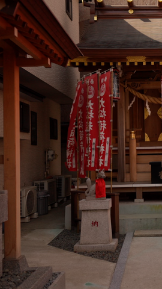
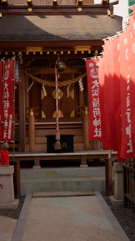

# RotateYourPhone

| Before | After |
|:------:|:-----:|
|  |  |

A robust FFmpeg-based video processing script for macOS that rotates, resizes, and prepends a custom intro to your videos, then encodes the result to high-quality HEVC (x265) 10-bit format compatible with QuickTime. The script is designed for creators who want to quickly convert landscape or 4K videos to vertical/portrait format for social media, with a branded intro and optimized output.

## Why Use This Script?

- **Automate tedious video rotation and reformatting tasks** for social media or mobile viewing.
- **Standardize your videos** with a consistent intro ("RotateYourPhoneHD.mp4") and output format.
- **Preserve quality** by using ProRes as an intermediate step before final HEVC encoding.
- **Batch process videos** with options to skip steps, control quality, and generate thumbnails.
- **No need to remember complex FFmpeg commands**—just run a single script.

## Features

- Rotates and resizes videos (e.g., 4K landscape to 1080x1920 portrait)
- Prepends a custom intro video (must be placed in `media/RotateYourPhoneHD.mp4`)
- Encodes final output to HEVC (x265) 10-bit, QuickTime compatible
- Generates optimized thumbnails at multiple timestamps (3 per timestamp: left, center, and right positions)
- Supports quality presets and optional intermediate file retention
- Smart handling of video rotation metadata and scaling

## Requirements

- macOS (tested on Apple Silicon M2 and newer)
- [FFmpeg](https://ffmpeg.org/) with HEVC and ProRes support (install via Homebrew: `brew install ffmpeg`)
- Bash shell (default on macOS)
- Place your intro video as `media/RotateYourPhoneHD.mp4` relative to the script (`media/RotateYourPhoneHD.mp4` file in the repository was downloaded from [@ariefngurahrai](https://www.youtube.com/shorts/pL4mDwgyEb8) YouTube channel).
- [ImageMagick](https://imagemagick.org/) (only required for running tests, install via Homebrew: `brew install imagemagick`)

> **Note:** This script is designed and tested for Apple Silicon (M2 and newer) Macs. It may require modifications to work on Intel Macs or other platforms, especially regarding hardware-accelerated encoding (`hevc_videotoolbox`).

## Installation

1. Clone this repository:

   ```zsh
   git clone https://github.com/ghisguth/RotateYourPhone.git
   cd RotateYourPhone
   ```

2. Make the script executable:

   ```zsh
   chmod +x rotate-your-phone.sh
   ```

3. Ensure your intro video is in `media/RotateYourPhoneHD.mp4` (replace with your own if desired).

## Usage

Basic usage:

```zsh
./rotate-your-phone.sh "MyVideo.mp4"
```

### Options

- `--skip-thumbnails` &nbsp;&nbsp;&nbsp;&nbsp;Skip thumbnail generation
- `--skip-rotation` &nbsp;&nbsp;&nbsp;&nbsp;&nbsp;&nbsp;Skip rotation and ProRes conversion (use existing intermediate file)
- `--skip-banner` &nbsp;&nbsp;&nbsp;&nbsp;&nbsp;&nbsp;&nbsp;&nbsp;Skip adding the intro banner video
- `--quality <level>` &nbsp;&nbsp;&nbsp;&nbsp;&nbsp;&nbsp;Set quality level (`fast`, `medium`, `high`, or `best`) [default: `best`]
- `--keep-intermediate` &nbsp;&nbsp;Keep the intermediate ProRes file after processing
- `--disable-hwaccel` &nbsp;&nbsp;&nbsp;&nbsp;Disable hardware acceleration and force software encoding
- `-o <output_dir>` &nbsp;&nbsp;&nbsp;&nbsp;&nbsp;&nbsp;&nbsp;&nbsp;Specify output directory [default: current directory]
- `--help` &nbsp;&nbsp;&nbsp;&nbsp;&nbsp;&nbsp;&nbsp;&nbsp;&nbsp;&nbsp;&nbsp;&nbsp;&nbsp;&nbsp;&nbsp;&nbsp;&nbsp;&nbsp;Display help message and exit

### Example Commands

- Process a video with default settings:

  ```zsh
  ./rotate-your-phone.sh "FREYA_2024.mp4"
  ```

- High quality, skip thumbnails:

  ```zsh
  ./rotate-your-phone.sh "FREYA_2024.mp4" --quality high --skip-thumbnails
  ```

- Keep the intermediate ProRes file:

  ```zsh
  ./rotate-your-phone.sh "FREYA_2024.mp4" --keep-intermediate
  ```

- Disable hardware acceleration:

  ```zsh
  ./rotate-your-phone.sh "FREYA_2024.mp4" --disable-hwaccel
  ```

- Combine options:

  ```zsh
  ./rotate-your-phone.sh "FREYA_2024.mp4" --skip-thumbnails --quality best --keep-intermediate --disable-hwaccel
  ```

## Output

- Final video: `<input>-RotateYourPhone-<quality>.mp4`
- Thumbnails: Three versions per timestamp - left, center, and right positions:
  - `<input>-Thumb-XXp-0.png` (left position)
  - `<input>-Thumb-XXp-1.png` (center position)
  - `<input>-Thumb-XXp-2.png` (right position)

  Where XX represents the percentage through the video (0, 5, 10, ..., 95)

## Usage Examples

### 1. Adding Intro Banner and Rotating Video

This example shows the transformation from landscape to portrait format with the intro banner added:

| Original Video | Rotated with Banner |
|:-------------:|:------------------:|
|  |  |

The script automatically detects the input video's orientation, adds the intro banner, rotates the content, and optimizes for vertical viewing.

### 2. Thumbnail Generation

The script can generate thumbnails at specified positions in the video:

| Original Video | Left Position | Center Position | Right Position |
|:-------------:|:------------:|:---------------:|:-------------:|
|  |  |  |  |

Thumbnails are generated at multiple timestamps with three variants each (left, center, and right positions). This is perfect for creating preview images for social media platforms.

### 3. Rotation Without Banner

Using the `--skip-banner` option, you can rotate videos without adding the intro:

| Original Video | Rotated without Banner |
|:-----------------:|:----------------------:|
|  |  |

This is useful when you want to maintain the original video's content but need it in portrait format.

## Testing

The script includes a comprehensive test suite located in the `tests` directory. The test suite verifies various quality settings, hardware acceleration options, and banner skipping.

### Requirements for Testing

- All requirements listed above
- ImageMagick (`brew install imagemagick`) for comparing image output

### Running Tests

```zsh
cd tests
./run-tests.sh
```

### Test Options

- `--update-test-data` &nbsp;&nbsp;Updates the expected test data with newly generated output
- `--keep-test-output` &nbsp;&nbsp;Keeps the generated output files after tests complete
- `--run-all` &nbsp;&nbsp;&nbsp;&nbsp;&nbsp;&nbsp;&nbsp;&nbsp;&nbsp;&nbsp;&nbsp;&nbsp;&nbsp;&nbsp;Runs all test scenarios (including slower ones)
- `--sanity-check` &nbsp;&nbsp;&nbsp;&nbsp;&nbsp;&nbsp;Runs only the 'best' quality scenario for quick verification
- `--help` &nbsp;&nbsp;&nbsp;&nbsp;&nbsp;&nbsp;&nbsp;&nbsp;&nbsp;&nbsp;&nbsp;&nbsp;&nbsp;&nbsp;&nbsp;&nbsp;&nbsp;&nbsp;Display help message and exit

Example:

```zsh
./run-tests.sh --sanity-check
```

## Customizing the Intro

Replace `media/RotateYourPhoneHD.mp4` with your own intro video. The script will always look for this file relative to its own location.

## License

MIT License. See [LICENSE](LICENSE) for details.

---

*Created by [Alexander Fedora](https://github.com/ghisguth). Contributions welcome!*

*RotateYourPhone created by [@ariefngurahrai](https://www.youtube.com/@ariefngurahrai)*
